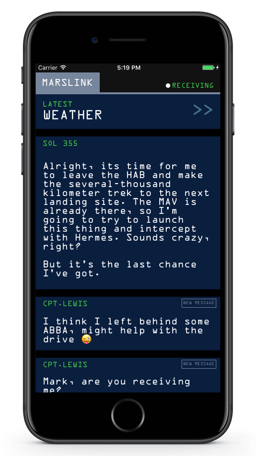

Marslink
==========

Marslink is a simple app demos the basic use of [IGlistKit](https://github.com/Instagram/IGListKit), which is a data-driven UICollectionView framework developed by Instagram. This app shows the following features:

- Use adapters and section controllers to populate mixture of data.
- Perform animations on collection views.

For all details, please reference Ray Wenderlich's [IGListKit Tutorial: Better UICollectionViews](https://www.raywenderlich.com/147162/iglistkit-tutorial-better-uicollectionviews)

## Screenshots
